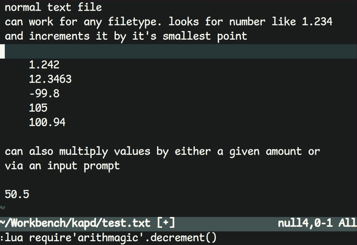

# Neovim arithmagic

Use this plugin for simple math operations on floating point numbers



Simply add in your plugin manager (ie: `Plug 'Dotrar/neovim-arithmagic'`) and set up some keybindings like below:
```vim
" use arrow keys, because who uses those for anything.. 
" increment the smallest amount, if no value, assumed 1.
nmap <up> :lua require'arithmagic'.increment()<CR>
nmap <down> :lua require'arithmagic'.decrement()<CR>
nmap <left> :lua require'arithmagic'.increment(5)<CR>
nmap <right> :lua require'arithmagic'.decrement(5)<CR>
" Multiply the number under the cursor, if without a value it will prompt
" for how much to multiply by
nmap <C-M> :lua require'arithmagic'.multiply()<cr>
```
